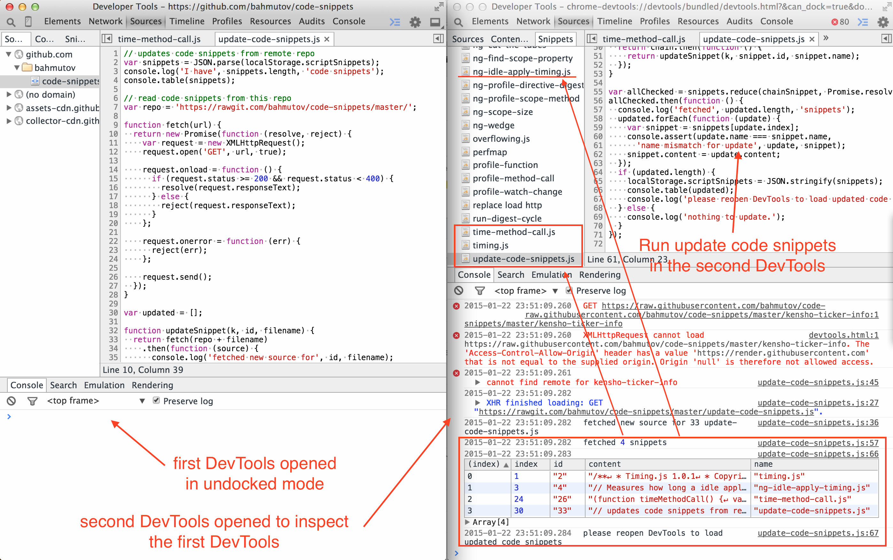

# Chrome DevTools code snippets

> Performance, debugging and testing code snippets to be run in Chrome DevTools

[![NPM][code-snippets-icon] ][code-snippets-url]

[![Build status][code-snippets-ci-image] ][code-snippets-ci-url]
[![dependencies][code-snippets-dependencies-image] ][code-snippets-dependencies-url]
[![devdependencies][code-snippets-devdependencies-image] ][code-snippets-devdependencies-url]
[![Codacy Badge][code-snippets-codacy-image] ][code-snippets-codacy-url]
[![semantic-release][semantic-image] ][semantic-url]

[code-snippets-icon]: https://nodei.co/npm/code-snippets.png?downloads=true
[code-snippets-url]: https://npmjs.org/package/code-snippets
[code-snippets-ci-image]: https://travis-ci.org/bahmutov/code-snippets.png?branch=master
[code-snippets-ci-url]: https://travis-ci.org/bahmutov/code-snippets
[code-snippets-dependencies-image]: https://david-dm.org/bahmutov/code-snippets.png
[code-snippets-dependencies-url]: https://david-dm.org/bahmutov/code-snippets
[code-snippets-devdependencies-image]: https://david-dm.org/bahmutov/code-snippets/dev-status.png
[code-snippets-devdependencies-url]: https://david-dm.org/bahmutov/code-snippets#info=devDependencies
[code-snippets-codacy-image]: https://www.codacy.com/project/badge/99acaf40b1f1483c80016eb31fbaef49
[code-snippets-codacy-url]: https://www.codacy.com/public/bahmutov/code-snippets.git
[semantic-image]: https://img.shields.io/badge/%20%20%F0%9F%93%A6%F0%9F%9A%80-semantic--release-e10079.svg
[semantic-url]: https://github.com/semantic-release/semantic-release


Read [Code Snippets tutorial][1],
[Performance profiling using DevTools code snippets][2] and
[How to improve Angular application performance using code snippets][3].

Note: code snippets do NOT have access to the full console API, for example no access to
`console.monitor`.

## Snippets

### Security

* [test-script-injection.js](test-script-injection.js) - tries to create a new
  inline script tag to test if page allows it.
* [harlem-shake-xss.js](harlem-shake-xss.js) - little XSS script that injects
  [Harlem Shake music](https://github.com/DinisCruz/XSS-Pocs/blob/master/pocs/dance-xss.js)

### DOM and CPU generic performance

* [boilerplate.js](boilerplate.js) - boilerplate for loading and running a remote code script
  (see [remote download](#remote-download)).
* [first-paint.js](first-paint.js) - time from page reload to first visible contents.
* [timing.js](timing.js) - Detailed page timing information,
  from [addyosmani/timing.js](https://github.com/addyosmani/timing.js).
* [time-method-call.js](time-method-call.js) - measures single method call time.
* [profile-method-call.js](profile-method-call.js) - profiles a single method call.
* [profile-prototype-method.js](profile-prototype-method.js) - profiles a single method call
  that is on a prototype object, not on an instance.
* [profile-separate-calls.js](profile-separate-calls.js) can profile actions where separate
  method calls start and stop the operation.
* [css-layout.js](css-layout.js) draws boundary around every DOM element for
  clarity.

### Storage measurements

* [local-storage-size.js](local-storage-size.js) - measures size of the strings in the `localStorage`.
* [expensive-keys.js](expensive-keys.js) - measures how much space individual keys and their values
take up in a collection of objects, read [Measuring Space Allocation][measure].
* [keys-vs-values.js](keys-vs-values.js) - measures length of keys vs length of values in an array.

### Angular performance

* [ng-count-watchers.js](ng-count-watchers.js) - counts total watchers in the page.
More watchers - slower digest cycle.
* [ng-idle-apply-timing.js](ng-idle-apply-timing.js) - measures how long a digest cycle takes without
any data changes. This measures purely how long all watched expressions take to compute and compare
to previous values (dirty checking).
* [ng-profile-scope-method.js](ng-profile-scope-method.js) - installs profile calls around a given
scope method. When the method completes, the original non-instrumented version will be restored.
The browser will have timeline and CPU profile.
* [ng-run-digest-cycle.js](ng-run-digest-cycle.js) - triggers digest cycle starting with root scope.
* [ng-profile-data-change.js](ng-profile-data-change.js) - changes data on the scope, runs digest cycle
to profile listeners.
* [ng-scope-size.js](ng-scope-size.js) - finds total size of all user objects attached to all scopes.
Smaller data - faster copying and comparison during digest cycle.
* [ng-find-scope-property.js](ng-find-scope-property.js) - finds all scopes that own a property
with given name.
* [ng-profile-local-digest.js](ng-profile-local-digest.js) - runs idle digest cycle starting at the scope
that surrounds given selector. Useful to find parts of the page with expensive watchers.
* [ng-find-expensive-digest.js](ng-find-expensive-digest.js) builds upon ng-profile-local-digest.js to measure
digest duration for several selectors and print sorted table starting with the slowest digest duration.
* [ng-monitor-digest-cycle.js](ng-monitor-digest-cycle.js) - prints a string every time a digest cycle runs.
* [ng-count-digest-cycles.js](ng-count-digest-cycles.js) - counts number of full digest cycles (from the root scope)
that run when a scope method executes. Useful because sometimes you can get away with just a local digest
cycle, rather than a full update. See [Local Angular scopes](http://glebbahmutov.com/blog/local-angular-scopes/).
* [ng-count-digest-cycle-simple.js](ng-count-digest-cycle-simple.js) - keeps counting number of times
the digest cycle runs.
* [ng-throw-error.js](ng-throw-error.js) throws an error from the digest cycle; useful for checking
if your [exception handler](http://glebbahmutov.com/blog/catch-all-errors-in-angular-app/) is working.

## Misc snippets

* [github-pull-request-template.js](github-pull-request-template.js) - better GitHub pull request
text, based on the blog post [Enforce standards while submitting a pull request](http://krasimirtsonev.com/blog/article/enforce-standards-while-submitting-a-pull-request) by [Krasimir Tsonev](https://github.com/krasimir).
* [remove-all-but.js](remove-all-but.js) - removes all elements in the page, except the ones in
the trees with specified selectors. Can be used to quickly clean up the page and leave just the essentials.

All snippets, including mine are distributed under MIT license.

## Updating local code snippets

You can update local code snippets by downloading new versions from this github repository.
Create a new code snippet and copy the source from [update-code-snippets.js](update-code-snippets.js).

Note: the approach below does not work any more,
see [the open issue](https://github.com/bahmutov/code-snippets/issues/23).

You will run this code snippet in an unusual way. First, open any web page, even an empty tab.
Open the DevTools in **undocked** mode (Command+Option+I on Mac). Then open the DevTools **again**,
*while focused* on the first DevTools. This will open the second DevTools instance with the source for the
first DevTools panels. If you inspect the `localStorage` variable in the second DevTools window, you will
find lots of interesting stuff, including all the code snippets in the `localStorage.scriptSnippets` property.

Whenever you want to update the your local code snippets in the Chrome DevTools, execute the `update-code-snippets.js`
snippet in the second DevTools instance. The update script looks at the your current code snippets and
tries to download a file with same name from the code snippets github repository (via [RawGit][RawGit]).
If the remote file has been downloaded successfully, it will replace the snippet.
After all snippets are checked, reopen the DevTools to load the updated source code.



Note, that only the latest source is downloaded, not any particular release.
Also, only code snippets with names matching existing files in this repo are replaced. If you do not
want to override a code snippet - just rename it, for example, remove the `.js` extension.

## Remote download a single script

You can download and run a single snippet by using the following boilerplate
(scripts are via downloaded via [RawGit][RawGit])

```js
(function firstPaintRemote() {
  // form rawGit proxy url
  var ghUrl = 'bahmutov/code-snippets/master/first-paint.js';
  var rawUrl = 'https://rawgit.com/' + ghUrl;
  // download and run the script
  var head = document.getElementsByTagName('head')[0];
  var script = document.createElement('script');
  script.type = 'text/javascript';
  script.src = rawUrl;
  head.appendChild(script);
}());
```


### Small print

Author: Gleb Bahmutov &copy; 2014

* [@bahmutov](https://twitter.com/bahmutov)
* [glebbahmutov.com](http://glebbahmutov.com)
* [blog](http://glebbahmutov.com/blog/)

License: MIT - do anything with the code, but don't blame me if it does not work.

Spread the word: tweet, star on github, etc.

Support: if you find any problems with this module, email / tweet /
[open issue](https://github.com/bahmutov/code-snippets/issues?state=open) on Github

[1]: http://glebbahmutov.com/blog/chrome-dev-tools-code-snippets/
[2]: http://glebbahmutov.com/blog/performance-profiling-using-devtools-code-snippets/
[3]: http://glebbahmutov.com/blog/improving-angular-web-app-performance-example/
[measure]: http://glebbahmutov.com/blog/measure-space-allocation/
[RawGit]: https://rawgit.com/
